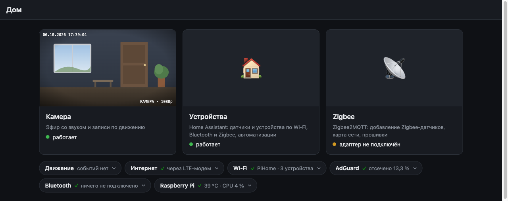
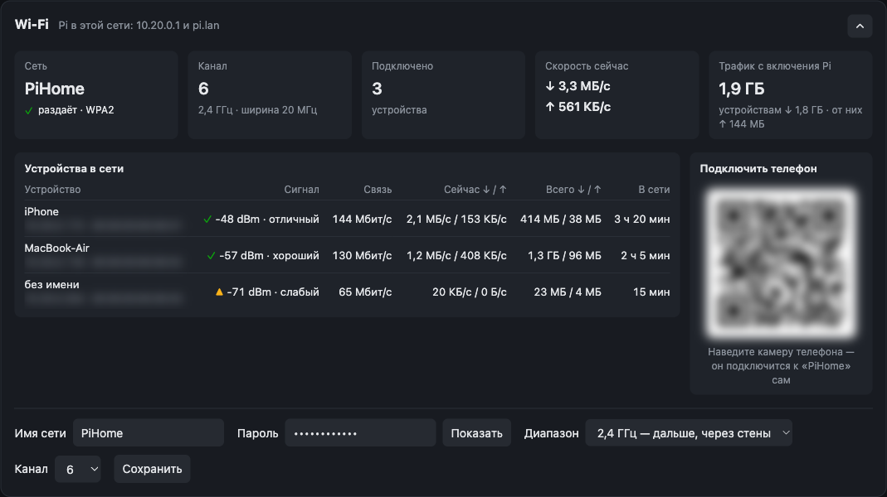
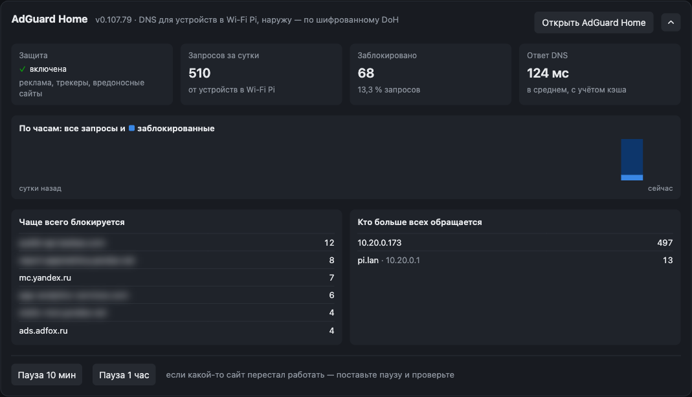
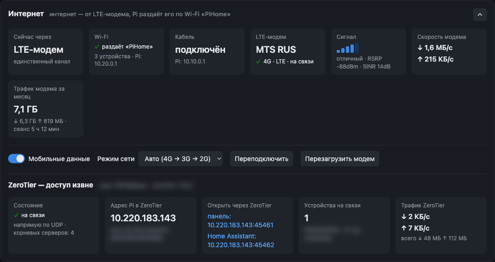
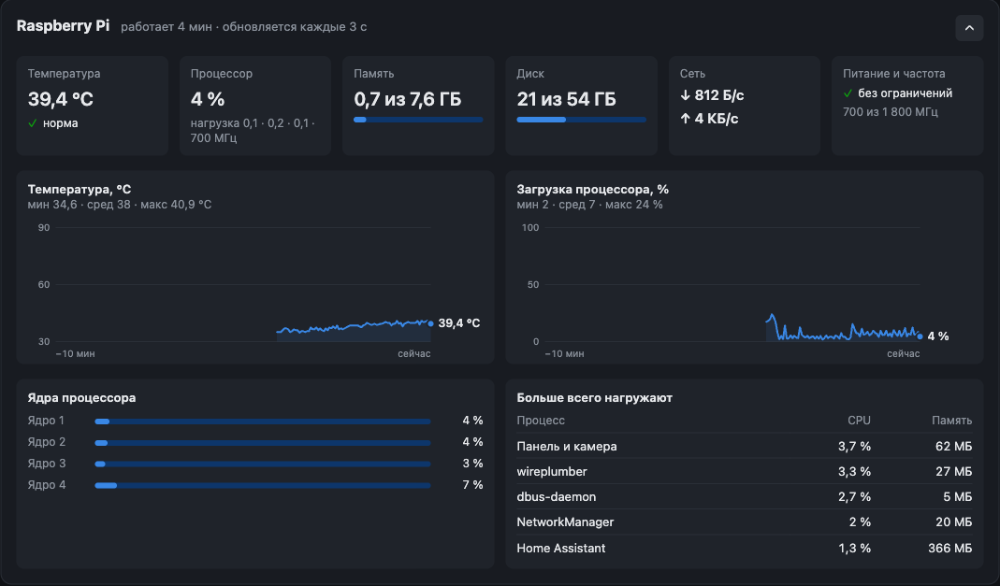
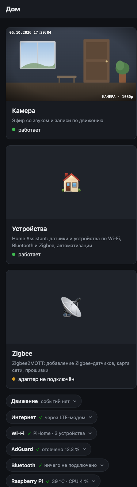

# pi-home-panel — домашний сервер на Raspberry Pi

Raspberry Pi 4 (Debian 13) как домашний хаб: раздаёт свой Wi-Fi с интернетом от LTE-модема,
блокирует рекламу, пишет видео по движению, собирает датчики (Bluetooth, Zigbee) в Home Assistant,
шлёт SMS, когда пропадал свет, стало холодно или камера заметила движение.
Всё — из одной веб-панели без входа: она видна только в локальной сети и через ZeroTier.

```
LTE-модем ──eth1──► Raspberry Pi ──wlan0──► Wi-Fi «PiHome»: интернет, панель, DNS с AdGuard
                         │        ──eth0───► кабель: только Pi и панель
                         ├─ панель :45461 ─► Home Assistant :45462, AdGuard Home :45463, Zigbee2MQTT /z2m
                         ├─ USB-камера, Bluetooth (BlueZ), Zigbee-адаптер (когда вставлен)
                         └─ ZeroTier — доступ извне
```

## Как выглядит



|  |  |
|:---:|:---:|
| Wi-Fi: устройства в сети, QR-код для подключения, настройки | AdGuard Home: блокировки за сутки, график, топы |
|  |  |
| Интернет: LTE-модем и доступ извне через ZeroTier | Мониторинг Pi: температура, процессор, память, процессы |

<details>
<summary>📱 На телефоне</summary>
<br>
<p align="center"></p>
</details>

Камера, LTE-модем и устройства в Wi-Fi на скриншотах — демонстрационные данные (камера не подключена,
SIM не вставлена); личное — QR-код с паролем Wi-Fi, ID сети ZeroTier, адреса устройств, часть статистики
AdGuard — размыто.

## Части

| Папка | Что это |
|---|---|
| [`webcam/`](webcam/README.md) | веб-панель: камера с записью по движению, Wi-Fi (устройства, QR-код, настройки), Bluetooth и BLE-датчики, AdGuard, интернет и модем, мониторинг Pi |
| [`network/`](network/README.md) | сеть Pi: точка доступа «PiHome», кабель, DHCP и локальные имена |
| [`modem/`](modem/README.md) | LTE-модем Huawei и сторож резервного канала |
| [`alerts/`](alerts/README.md) | SMS-оповещения через модем: пропадало питание, холодно у датчика, движение у камеры — настройка в панели |
| [`adguard/`](adguard/README.md) | AdGuard Home: блокировка рекламы, шифрованный DNS наружу |
| [`homeassistant/`](homeassistant/README.md) | Home Assistant в Docker |
| [`zigbee/`](zigbee/README.md) | Zigbee2MQTT, запускается сам, когда вставлен адаптер |

## Адреса

| | Wi-Fi «PiHome» | Кабель |
|---|---|---|
| Панель | http://10.20.0.1:45461 или http://pi.lan:45461 | http://10.10.0.1:45461 |
| Home Assistant | http://10.20.0.1:45462 | http://10.10.0.1:45462 |
| AdGuard Home | http://10.20.0.1:45463 | http://10.10.0.1:45463 |
| SSH | `ssh dosash@10.20.0.1` | `ssh dosash@10.10.0.1` |

## Что не в репозитории

Секреты и данные остаются на Pi (см. `.gitignore`). Храните их копию отдельно от репозитория.

| Где | Что | Образец |
|---|---|---|
| `webcam/webcam.env` | пароль панели (сейчас вход выключен) | `webcam/webcam.env.example` |
| `webcam/sessions.json` | сессии входа в панель | — |
| `adguard/adguard.env` | пароль администратора AdGuard Home | `adguard/adguard.env.example` |
| `zigbee/data/` | настройки Zigbee2MQTT **с ключом Zigbee-сети** — потеряете, датчики придётся сопрягать заново | `zigbee/configuration.example.yaml` |
| `homeassistant/config/` | всё, кроме своего YAML: база, журналы, токены (`.storage`) | — |
| `webcam/recordings/` | записи камеры | — |
| профиль NetworkManager `hotspot` | пароль Wi-Fi «PiHome»: `sudo nmcli -s -g 802-11-wireless-security.psk connection show hotspot` | `network/README.md` |
| `alerts/settings.json` | номера телефонов для SMS и что включено (меняется в панели, раздел «SMS») | — |
| `homeassistant/.env` | часовой пояс (`TZ=…`) для контейнера HA | — |
| `/opt/AdGuardHome/AdGuardHome.yaml` | настройки AdGuard Home (описаны в `adguard/README.md`) | — |

## Установка на чистую Pi

По порядку, в каждой папке README с командами: `network` (точка доступа и кабель) → `modem`
(резервный канал) → `webcam` (systemd-юнит панели, пакеты GStreamer) → `homeassistant`
(`docker compose up -d`) → `zigbee` → `adguard` → `alerts`.

## Лицензия

MIT — см. `LICENSE`. Исключение: `webcam/vendor/segno` — библиотека segno, BSD-3-Clause (`webcam/vendor/segno/LICENSE`).

## Тесты

```sh
cd webcam && python3 -m unittest discover -s tests   # расшифровка BLE-датчиков
cd alerts && python3 -m unittest discover -s tests   # SMS-оповещения: питание, температура
```
